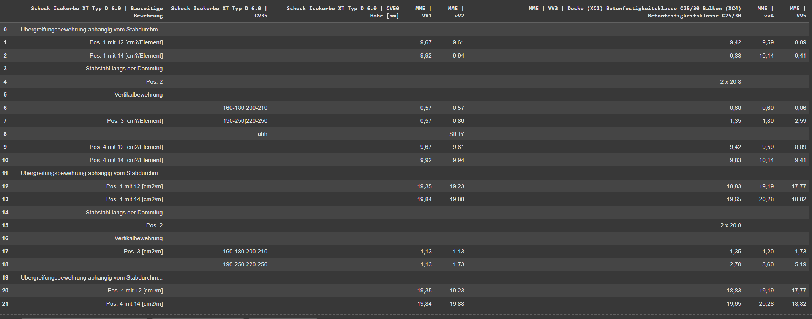

# PDF Extraction and Retrieval Framework

## Setup

### Step 1: Create a Virtual Environment
For Linux:
```bash
python3 -m venv venv
source venv/bin/activate
```

For Windows:
```cmd
python -m venv venv
venv\Scripts\activate
```

### Step 2: Install Dependencies
Install the required dependencies using:
```bash
pip install -r requirements.txt
```

### Step 3: Configure API Keys
Set up the necessary keys in the `config.py` file:
- **Jina API Key:** Visit [Jina Embeddings](https://jina.ai/embeddings/) to obtain your key.
- **Groq API Key:** Visit [Groq Console](https://console.groq.com/keys) to generate your key.
- **Aryn API Key:** Visit [Aryn AI](https://www.aryn.ai/get-started) (you need to provide your email ID).

### Step 4: Run Indexing
Once the keys are configured, execute the indexing process with the following command:
```bash
python indexing.py
```

This will:
- Extract elements like text and tables from the PDF.
- Create a vector store if it does not already exist.
- Summaries for tables are stored in `table_summaries.json`. If this file already exists, the summaries will be loaded directly. If you wish to generate new table summaries, delete the `table_summaries.json` file and run `generate_table_summaries.py`.

### Step 5: Run the Streamlit App
After running the indexing step, start the Streamlit app with the following command:
```bash
streamlit run main.py
```

This will launch the web-based interface for querying the system.

## Artifacts Generated
- **`sub_documents.json`**: Each item corresponds to an element (e.g., text, table) detected using the OCR tool.
- **`documents.json`**: Each item represents the text content of a page.
- **`table_summaries.json`**: Summarized content of table elements detected.
- **`evaluation_results.csv`**: Contains generated answers along with their evaluation scores.

## Extraction Process
- **OCR-Based Extraction**: Used to extract text and tables from the PDF while preserving the structure of the table elements.
- **Chunking**: Each extracted element is treated as a chunk. For tables, a summary is generated using an LLM, and this summary is used as a text chunk instead of the raw table data.

## Retrieval Mechanism
- **Ensemble Retriever**: Utilizes LangChain's framework to combine both vector search and keyword search. Given that the PDF is a technical manual, keyword search can provide additional benefits.
- **Fusion Algorithm**: The results from vector search and keyword search are combined using the Reciprocal Rank Fusion algorithm.
- **Meta Information**: The retrieved chunks contain page numbers as metadata. The text from these page numbers, including the content of tables, is passed to the LLM to generate responses.

## Models Used
- **Embedding Model**: The multilingual `jina-embeddings-v3` model is chosen for its superior performance on the [MTEB leaderboard](https://jina.ai/news/jina-embeddings-v3-a-frontier-multilingual-embedding-model/).
- **Language Model**: The open-source `llama-3.3-70b-versatile` model is used for its superior performance. Refer to [Groq's Benchmark](https://groq.com/new-ai-inference-speed-benchmark-for-llama-3-3-70b-powered-by-groq/) for details.

## How It Works
- **Query Submission**: A user submits a query to the system.
- **Embedding Generation**: The query is transformed into an embedding.
- **Search Mechanisms**:
  - A **vector search** is performed in ChromaDB.
  - A **keyword search** is conducted using the BM25 algorithm.
- **Fusion of Results**: The Ensemble Retriever merges results from both search methods using a reciprocal rank fusion algorithm.
- **Keyword Search Justification**: Keyword search is particularly effective for technical manuals as it efficiently identifies exact matches.
- **Metadata Utilization**: Each retrieved chunk includes page numbers as metadata.
- **Content Aggregation**: All textual and tabular content from the identified pages is aggregated.
- **Prompt Preparation**: The aggregated content is formatted into a prompt for a Large Language Model (LLM).
- **Response Generation**: The LLM processes the comprehensive input and generates a relevant response.

## Evaluation
- **Evaluation Method**: An LLM is used as the evaluator. It is provided with the query, reference answer, and generated answer, and it assigns a score of `0` or `1` based on how well the generated answer addresses the query.
- **Prompt**: The evaluation prompt used can be found in `prompts.py`.
- **Results**:
  - Out of 34 queries provided, the system scored `1` for 22 queries and `0` for the rest, resulting in an average accuracy of **64.7%**.
- The evaluation results are stored in `evaluation_results.csv` for review.

## Areas of Improvement

1. **Table Summaries**:
   - The quality of table summaries can be improved by using a higher-performing LLM.
   - Currently, the **llava-v1.5-7b-4096-preview** model is used due to token limitations on the Groq cloud platform. However, using a more capable model like **llama-3.3-70b-versatile (open source)** could yield better results, especially    given that many queries rely on table information.

2. **Context for Summaries**:
   - Table summaries are currently generated by sending only the CSV format of the table extracted from the OCR tool.
   - Incorporating the surrounding text from the same page as the table could provide additional context, enabling the LLM to generate more accurate and concise summaries without redundancy.

3. **OCR Limitations**:
   - The OCR tool struggles with complex tables containing merged cells, leading to structural changes that hinder the LLM's ability to process queries related to those tables. Below, you can see an example where the original table from the PDF has merged cells, and the OCR-extracted table does not preserve the structure correctly:

   #### Original Table from PDF
   

   #### OCR-Extracted Table
   

   - To address these issues, using vision-based transformers, such as the one proposed in [this paper](https://arxiv.org/abs/2407.01449), could significantly improve content extraction, especially for complex table structures.

4. **Utilizing Removed Elements**:
   - Currently, elements like images and section headers are discarded after OCR processing.
   - Instead of discarding these, they can be leveraged to enhance system performance. For example, images could be described using a multimodal LLM, and these descriptions could be embedded.

By addressing these areas, the system's overall accuracy can be improved.